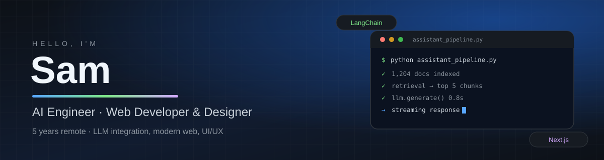

  

### Hi, I'm Sam 👋

Software Engineer with **5 years of fully remote experience**, working with distributed teams across time zones. I own the whole path: the interface, the API behind it, the schema, and the container it ships in — most recently a retrieval-augmented search service and a client-side counterpart to it.

### 📈 Highlights

- Built **[rag-server](https://github.com/anna123123123-creator/rag-server)** — a FastAPI + SQLite
  retrieval service: sentence-aware chunking, server-side ONNX embeddings, a REST search API,
  cascading deletes, a Dockerfile that bakes the model into the image, and a measured
  confidence threshold so the API can answer "nothing here" instead of guessing.
- Built **[Browser RAG](https://github.com/anna123123123-creator/browser-rag)** — retrieval-augmented
  search that runs entirely in the client: own chunking with sentence overlap, local
  MiniLM embeddings on WebAssembly, cosine ranking. No server, no API key, nothing uploaded.
- Integrated LLM-powered conversational assistants and automated content pipelines into client products, writing the retrieval and context layers myself.
- Shipped 50+ open-source browser tools and publish a catalogue of 60+ business-system and AI source-code products through my own storefront, handling delivery and after-sales directly.
- 5 years of remote contract work with international clients, coordinating asynchronously across time zones and documenting decisions in writing.

### 🧰 Toolbox

- **Back-end & data** — Python, FastAPI, REST API design, SQLite (schema design, foreign keys, indexes, cascading deletes), Docker and docker-compose, ONNX Runtime
- **AI integration** — retrieval-augmented search (chunking, embeddings, cosine ranking), LLM API integration, prompt and context design, measured confidence thresholds
- **Front-end** — JavaScript (ES6+), HTML/CSS, Canvas and SVG rendering, Web Audio and Web Speech APIs, responsive UI, no-build-step delivery
- **Design & content** — Figma to production code, SEO, web editing
- **Also work with** — Node.js, PostgreSQL, React, Next.js, TypeScript, Git

### 🧪 Built in the open

Browser tools I ship in public — no backend, no signup, no build step, each with a live demo:

| Project | Where |
| --- | --- |
| **[rag-server](https://github.com/anna123123123-creator/rag-server)** — the same idea as a service: FastAPI + SQLite, server-side embeddings, REST API, Dockerised | [source](https://github.com/anna123123123-creator/rag-server) |
| **[Browser RAG](https://github.com/anna123123123-creator/browser-rag)** — asks your own documents a question and returns the passages that answer it, entirely client-side | [demo](https://anna123123123-creator.github.io/browser-rag/) |
| **FAQ bot** — keyword-matching Q&A assistant | [open](https://anna123123123-creator.github.io/faq-bot/) |
| **Outline → mind map** — parses an indented outline into a tree and lays it out in ~200 lines of vanilla JS | [open](https://anna123123123-creator.github.io/outline2mindmap/) |
| **Outline → slides** — outline to slide deck preview | [open](https://anna123123123-creator.github.io/outline2slides/) |
| **Resume ⇄ JD matcher** — keyword match scoring | [open](https://anna123123123-creator.github.io/resume-match/) |
| **Text to speech** — reads text aloud in the browser | [open](https://anna123123123-creator.github.io/text-to-speech/) |

53 public repositories, 50 of them with a live demo.

---

### 📫 Get in touch

- 🌍 **Manila, Philippines** — available for remote work worldwide
- 🔗 **Product catalogue & storefront** — [inzyxuashop.com](https://inzyxuashop.com)
- 📱 **WhatsApp** [+63 947 371 8280](https://wa.me/639473718280)
- ✉️ **Email** evcdecd@gmail.com

Open to full-time remote roles and contract work: LLM integration, Next.js builds, and Figma-to-code.
